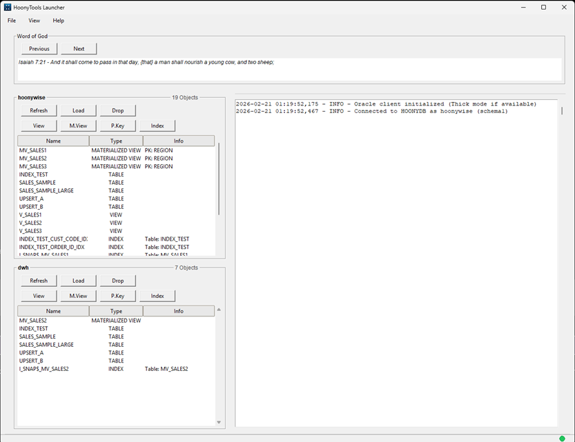

<table>
  <tr>
    <td></td>
    <td><h1 style="margin-left: 10px;">HoonyTools</h1></td>
  </tr>
</table>
Lightweight Python-based toolkit for loading, transforming, and cleaning data in Oracle databases.

Created by Jihoon Ahn [@hoonywise](https://github.com/hoonywise)  
Contact: hoonywise@proton.me

[](LICENSE.md)
[](https://www.paypal.com/donate/?hosted_button_id=NJSTAENDWQLXS)

---



---

HoonyTools is an all-in-one Python-based toolkit for loading, transforming, and cleaning data in Oracle databases.

Designed with front-end users in mind, HoonyTools features an intuitive GUI that makes it easy to load data into Oracle as tables or views, run batch imports, and perform record-level cleanup.

With built-in support for Excel and CSV formats, and customizable database connections via user-defined DSNs, HoonyTools is ideal for daily ETL, research, and reporting workflows.

---

## 🧑‍💻 Quick Start

### Both EXE and Python PYW Versions Available

HoonyTools now runs either as a standalone EXE or directly as a Python GUI app.

**First-Time Setup:**

- EXE users:

1. Download the latest `HoonyTools.exe` from the [Releases](https://github.com/hoonywise/HoonyTools/releases) page.
2. Place the file in a folder of your choice.
3. Launch the app by double-clicking `HoonyTools.exe`.

- PYW users:

1. Download the latest `HoonyTools_vX.X.X_python.zip` from the [Releases](https://github.com/hoonywise/HoonyTools/releases) page.
2. Unzip the file to a folder of your choice.
3. Ensure [Python 3.13+](https://www.python.org/downloads/) is installed
4. Open a terminal in the unzipped folder and run:  
   ```
   pip install -r requirements.txt
   ```
5. Launch the app by double-clicking `HoonyTools.pyw'.

✅ This launches the GUI with **no terminal window**

---

## 🗂️ Folder Structure

> EXE version will create the necessary folders automatically.

After unzipping `HoonyTools_vX.X.X_python.zip`, you should see:

```
HoonyTools/
├── HoonyTools.pyw                  # Main launcher (double-click this)
├── README.txt                      # Quickstart user guide
├── LICENSE.md                      # Licensing terms
├── CHANGELOG.md                    # Release notes
├── requirements.txt                # (Optional) Python modules if running from source)
├── libs/                           # Shared utility modules (Oracle, config, logging, etc.)
│   ├── config.ini                  # Created at first login if "Save password" is checked
│   ├── setup_config.py             # Setup script for login
│   ├── paths.py                    # Filepaths for domain-specific folders
│   ├── mv_log_utils.py             # MV log detection helpers used by loaders and tools
│   ├── pk_designate_settings.json  # persisted settings for PK Designator
│   ├── oracle_db_connector.py      # Oracle connection helper (get_db_connection)
│   ├── session.py                  # Session memory for credentials and states
│   ├── abort_manager.py            # Coordinated abort/cleanup helper used by loaders
│   ├── table_utils.py              # Common table utilities (DDL helpers)
│   ├── layout_definitions.py       # UI layout helper constants
│   ├── bible_books.py              # small lookup for book names (used by some tools)
│   └── en_kjv.json                 # embedded JSON data for KJV text (used by demo/tools)
├── loaders/                        # Loaders (Excel, CSV, SQL, etc.)
│   ├── excel_csv_loader.py         # Excel/CSV Loader GUI (APPEND/REPLACE/UPSERT, preview)
│   ├── sql_view_loader.py          # SQL View Loader (create view from pasted SQL)
│   └── sql_mv_loader.py            # SQL Materialized View Loader (creates MVs, offers MV log creation)
├── tools/                          # Object cleanup tools and extractors
│   ├── object_cleanup_gui.py       # Object Cleanup (drop tables/views/mviews/mlogs/pks)
│   ├── mv_refresh_gui.py           # Materialized View Manager (refresh, create/reuse/drop logs)
│   └── pk_designate_gui.py         # Primary Key Designator (inspect tables, create PKs safely)
└──  assets/                         # Icons and splash images
```

---

## 🛠️ Setup Requirements

To run HoonyTools, you’ll need the following installed and configured:

---

### ✅ Python 3.13 or Higher

1. Install from the official site:  
   👉 [https://www.python.org/downloads/](https://www.python.org/downloads/)

2. During installation, make sure to check:  
   ✅ “Add Python to PATH”

---

### 🧩 Required Python Packages

Once Python is installed, run the following from the HoonyTools folder:

```
pip install -r requirements.txt
```

This installs all required libraries including:

- `oracledb` (for Oracle connectivity)
- `pandas`, `openpyxl` (for Excel/CSV processing)
- `pywin32`, `pystray`, `Pillow` (for GUI tray features and icon support)

---

### 🛢️ Oracle Instant Client

To connect to Oracle databases, the **Oracle Instant Client** must be installed and properly configured:

1. **Add the Instant Client folder to your system PATH**  
   Example:
   ```
   C:\oracle\instantclient_21_13
   ```

2. **Create a `tnsnames.ora` file** inside your Oracle `network/admin` folder  
   or set the `TNS_ADMIN` environment variable to point to it.

   This file defines named DSNs such as `DWHDB_DB` used by HoonyTools.

   Example entry:
   ```
   DWHDB_DB =
     (DESCRIPTION =
       (ADDRESS = (PROTOCOL = TCP)(HOST = your.hostname.edu)(PORT = 1521))
       (CONNECT_DATA =
         (SERVICE_NAME = XEPDB1)
       )
     )
   ```

3. **Test with `sqlplus` or `tnsping`**  
   Example:
   ```
   sqlplus your_username@DWHDB_DB
   ```

If you can connect via `sqlplus`, HoonyTools will work too.

📥 [Download Oracle Instant Client](https://www.oracle.com/database/technologies/instant-client/downloads.html)

---

## 🚀 How to Launch

Simply double-click `HoonyTools.pyw` or 'HoonyTools.exe' to launch the application.

This file opens without a terminal window and starts the GUI immediately.

---

### 🧭 GUI Usage

Once launched, the GUI gives access to all tools via an intuitive interface:

- Object list for `user` and `dwh` schemas.
- Load Excel and CSV files
- Delete tables from your Oracle schema or DWH shared schema.
- Create SQL views from SQL files
- View console logs and abort operations gracefully

You can run as often as needed — no admin rights or elevated privileges required.

---

## 🛠 Available Tools


- **SQL View Loader**  
  - Instantly create Oracle views from pasted sql queries.  

- **SQL Materialized View Loader**  
  - Create materialized views from pasted SQL and optionally create required materialized view logs. Offers log creation UI with `WITH ROWID` / `WITH PRIMARY KEY` and `INCLUDING NEW VALUES` options. Safer detection and debug info included.

- **Materialized View Manager**  
  - Browse existing materialized views, request COMPLETE refreshes, and manage materialized view logs (create, reuse, or Drop & Recreate). Shows refresh type (ON DEMAND / ON COMMIT) and per-base current log types; FAST refresh is intentionally not offered.

- **Primary Key Designator**  
  - Inspect tables, detect PK candidates (single-column or composite), run safe null/duplicate checks, and add PRIMARY KEY constraints with confirmation and configurable constraint naming.

- **Excel/CSV Loader**  
  - Load Excel or CSV files into Oracle from a local file picker.  
  - Auto-maps column headers and preserves datatypes.
  - Provides options for:
    - `APPEND` Loading into existing tables or creating new ones.
    - `REPLACE` Truncating existing tables before loading.
    - `UPSERT` Upserts records based on selected unique keys.
    - Formatted SQL Preview (default ON)
      - When loading into an existing table you can preview the generated SQL `APPEND` `REPLACE` `UPSERT` before execution.
      - The preview window shows nicely formatted SQL, is centered, and is resilient to focus/grab issues across platforms.
      - Preview includes `Copy SQL` and `Save to .sql` actions so you can easily copy or persist the generated SQL.
      - Upsert `MERGE` creates a temporary staging table and runs server-side validations (`merge_with_checks`) in dry-run mode to produce accurate counts and MERGE SQL; staging is dropped after preview or execution.

- **Object Cleanup (Table/View/Materialized View/PK/Logs)**  
  - Drop tables, views, materialized views, materialized view logs, and primary key constraints from your schema or the shared DWH schema.  
  - The GUI prefers materialized views when an underlying table shares the same name to avoid accidental failures.  
  - Use with caution — these actions are destructive and irreversible.

---

## 📌 Notes for Users

- Ensure your **Oracle Instant Client** is properly installed and configured (see setup section above).
- You must be connected to your institution’s network or VPN if the Oracle database is not publicly accessible.
- All tools require a valid Oracle **DSN (Data Source Name)** such as `DWHDB_DB`. You may define your own DSN in `tnsnames.ora` to point to your organization’s database.
  - The first time you run a tool that connects to Oracle, you will be prompted for your **username, password, and DSN**.  
  - A **"Save password"** checkbox is available in the login popup. If checked, your credentials will be saved in `libs/config.ini` for future GUI launches. If unchecked, it will only store for the duration of the current session.
  - The Object Cleanup tool is destructive; when in doubt, take a backup or verify with your DBA before dropping objects or constraints.
- **Use caution when working with production databases**. Certain tools (e.g., loaders and Object Cleanup) can delete and overwrite data.
- For best results, always review your files before running a loader, and monitor the logging window for any errors or warnings.

> 🧠 **Note:** This toolset interacts directly with the Oracle Data Warehouse (DWH). Ensure you understand the impact of any actions, particularly when loading data with loaders or using cleanup tools.

> 💡 **Tip:** To reset your saved DWH credentials (e.g., if the DSN or password changes), simply delete the `libs/config.ini` file. The next time you launch a DWH-related tool, HoonyTools will prompt you to enter new login information and ask whether to save it again.

---

## 📜 License

HoonyTools is free for individual, non-commercial use.  
Use across departments or organizations may require a license.

📩 **For enterprise use or questions, contact:**  
**[hoonywise@proton.me](mailto:hoonywise@proton.me)**

For full terms, see [LICENSE.md](LICENSE.md).
